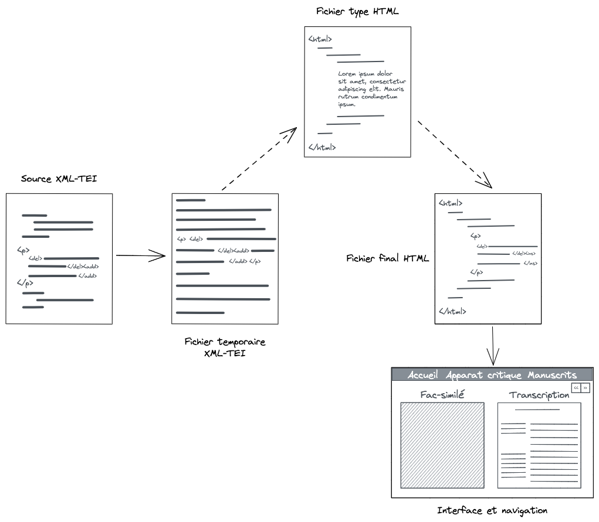

# (Travail en cours)

# Documentation technique
L’interface Flaubert transforme des fichiers XML-TEI en HTML pour obtenir une visualisation côte à côte de fac-similés et de leur transcription. Cette transformation repose principalement sur le langage de programmation Python, ainsi que sur du JavaScript pour la navigation de l’interface locale. Élaborée à partir d’un corpus génétique, cette interface a pour objectif de conférer aux éléments sémantiques XML-TEI des caractéristiques visuelles pour parvenir à une visualisation de la transcription semi-diplomatique, à partir des fonctionnalités de développement web.

## Une interface web
Nous avons fait le choix pour cette interface d’un site web statique, c'est-à-dire qui repose sur une mise à jour manuelle à partir de Python. L’option d’un site web dynamique, qui aurait reposé sur un langage côté serveur (par exemple, le langage PHP) et qui aurait permis de générer les pages à la volée, aurait notamment rendu possible la conversion automatique du XML-TEI. Mais cette solution n’était pas envisageable selon nos connaissances en développement web. De cette façon, le socle technique de l’interface répond à la fois à nos compétences techniques, mais également à nos questionnements scientifiques relevant de la génétique textuelle. C’est en effet par la mise en œuvre d’éléments techniques de développement web qu’il nous est possible de conserver à travers la visualisation une transcription semi-diplomatique des manuscrits (et non une modernisation de ceux-ci), qui restent ainsi au cœur de l’analyse de notre corpus.

La conception de l’interface est réalisée à partir de la librairie de design Bootstrap[^1]. Grâce à ses fonctionnalités, l’interface possède ainsi un header présent en haut de chaque page, permettant de naviguer à travers l’infrastructure du site. Elle contient également un footer, contenant notamment un hyperlien vers la mention des responsabilités juridiques relatives à l’interface. Bootstrap a été de plus utilisé pour la mise en page du menu principal de l’interface, comprenant la présentation des trois auteurs du corpus ainsi que des liens vers les trois transcriptions à partir d’un carrousel interactif ; ainsi que pour l’apparat critique, contenant la présentation et l’analyse du dossier génétique. L’utilisation de cette librairie permet d’obtenir une conception responsive du design, c'est-à-dire que le contenu s’adaptera à la taille de l’écran de l’utilisateur. C’est également en utilisant cette librairie que nous avons créé une page cadre, `lorem-ipsum.html`, utilisé pour l’importation des transcriptions sémantiques réalisées par un encodage XML-TEI.

[^1]: Créée en 2011 par Mark Otto et Jacob Thornton, Bootstrap est une librairie de conception web reposant sur le HTML et CSS et proposant des éléments de design interactifs et responsives ; la librairie contient également des extensions en JavaScript. [En ligne], https://getbootstrap.com/. Consulté le 17 juin 2022.

## Encodage XML-TEI des transcriptions
Les fichiers XML-TEI reposent sur un schéma personnalisé mêlant la description de manuscrit et celle du théâtre ; ce schéma a été obtenu à partir de l’outil de customisation Roma mis en place par le consortium de la TEI. La première catégorie permet d’apporter des éléments descriptifs pour ce qui concerne le support des brouillons (changements de folios, éléments de codicologie dans l’en-tête de l’encodage qui comporte les métadonnées) et l’édition génétique (suppressions, ajouts, changements de main, commentaires, etc.). La seconde apporte un encodage sémantique de la structure théâtrale des brouillons, en différenciant notamment les différents personnages et leurs prises de parole, ainsi que toute description scénique et autres didascalies ; et en structurant en actes et en scènes les transcriptions.

## Transformation en HTML : fonctionnement du script Python
Le script transforme tout d’abord certains éléments XML pour qu’ils deviennent valides en HTML ; chaque élément est traité individuellement avec la librairie BeautifulSoup[^2], utilisée pour le traitement et la transformation de documents XML et HTML. Nous avons ici conservé le plus possible la sémantique de l’encodage à partir de balises HTML précises. Ces changements sont rangés dans le fichier temporaire `tempFile.xml`, créé par commodité dans l’écriture du code.

[^2]: Librairie Python créée par Leonard Richardson permettant de traiter des fichiers HTML et XML pour ensuite y naviguer, y effectuer des recherches et les modifier. [En ligne], https://www.crummy.com/software/BeautifulSoup/bs4/doc/. Consulté le 17 juin 2022.

Ensuite, en utilisant des expressions régulières appliquées au fichier source XML, la structuration de ce dernier est modifiée pour obtenir une visualisation correcte dans l’interface, rangée dans le fichier temporaire de nouveau. Les éléments sémantiques (`<sp>`, `<speaker>`) sont supprimés et peuvent être remplacés si besoin par des sauts de ligne. C’est également lors de cette étape que des classes ayant pour valeur `myText` et `myImage` sont ajoutées aux blocs comportant les fac-similés et les transcriptions pour permettre ensuite leur numérotation.

La troisième étape est la création du fichier HTML final. À partir du fichier type `lorem-ipsum.html` qui est utilisé comme cadre à la mise en ligne de corpus, l’intégralité de la transcription précédemment modifiée qui se trouve dans le fichier temporaire est placée à l’intérieur de la div identifiée par l’`@id mainText`.
  
## Navigation : JavaScript
La navigation à travers les div du fichier html, c'est-à-dire les folios du manuscrit, se fait par la modification un paramètre de l’URL courant à partir de la numérotation établie avec Python des classes `myText` et `myImage`. Il est alors possible d’afficher la section courante comprenant le fac-similé et sa transcription, à partir d’un paramètre comprenant l’identifiant `id` et sa numérotation. Nous obtenons ce type d’URL : `g340.html?id=1`. Une fois que cela est établi, le JavaScript vient modifier l’URL des boutons de navigation `previous` et `next`, en ajoutant ou soustrayant la valeur `1` au numéro du folio actuel, ce qui permet alors d’obtenir le passage d’un folio à l’autre.
  
## Librairies utilisées
  
|  Librairies   | Versions |
|---------------|----------|
| Bootstrap     | 4.6.1    |
| BeautifulSoup | 4.11.1   |
  
## Schéma éditorial

  
# Développements en cours
  
## Bugs connus
- Bug de la navigation pour la première et la dernière section ;
- Le responsive (pour le bouton du mode sombre, pour les ajouts marginaux).
  
## Fonctionnalités à venir
-	Création d’une variable dans le code Python en remplacement du fichier temporaire ;
-	Meilleure gestion des ajouts marginaux ;
-	Titres individuels (acte, scène) pour chaque folio.
